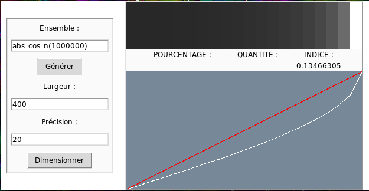

# TIPE "Etude de l'équirépartition de suites denses"

Le TIPE (Travail d'Initiative Personnelle Encadré) est un mini projet de recherche comptant pour les concours de classes préparatoires scientifiques et gravitant autour d'un thème. Le thème de mon année est : "Optimalité : choix, contrainte, hasard".

Ce TIPE a été réalisé par [Lucas Willems](http://www.lucaswillems.com) et a été le fruit d'un travail en commun avec Arthur Lindoulsi, Hugo Fages et Martin Mascaron.

Il contient :
- mon rapport pour les ENS
- mon diapo
- le code (Python 3) utilisé pour obtenir les images et représentations graphiques

Pour utiliser le code, vous devez exécuter la commande `python main.py` depuis le dossier `code`.
